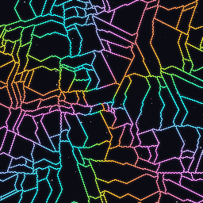
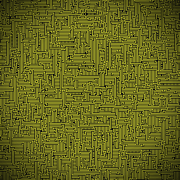
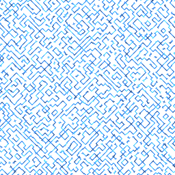

# Wave Overlap

<div align="center">
  
  
  
</div>

**Wave Overlap** is an interactive web application that demonstrates the powerful **Wave Function Collapse (Overlapping Model)** procedural generation algorithm running directly in your browser. 

Designed to combine **interactivity** and **high performance**, this application demonstrates **Polyglot Programming** by uniting the Web and Backend ecosystems. It allows users to draw simple patterns on a grid, and in real time, watch the algorithm "collapse" the possibilities to generate a new, larger image that is structurally coherent with the original pattern.

---

## ✦ Key Features

- **◈ Interactive Drawing:** An intuitive canvas for users to create their own input patterns.
- **⟡ Real-Time Generation (Live Preview):** Watch the WFC decision process cell by cell, without UI freezes.
- **⬡ Extreme Optimization with WASM:** All computational load is executed in **Go compiled to WebAssembly (WASM)**. The conscious use of raw data structures (`Uint8Array`) ensures high speed and prevents Garbage Collector bottlenecks.
- **❖ Zero Serialization (Shared Memory):** Uses `SharedArrayBuffer` for data exchange between React and the WASM module, ensuring instant screen updates at 60FPS.
- **▣ Modern and Responsive Interface:** Built with React 19 and Vite, providing a polished and agile user experience.

---

## ▤ Sharing and Exporting Systems

The application has a robust ecosystem to export your creations and share them with the community or use them in game engines:

- **🔗 Direct Link (State Sharing):** The complete state of the grid, seed, and post-processing settings are packaged (`nibble-pack`), natively compressed (CompressionStream), and converted into a URL-safe Base64 string. This generates a lean link that allows other users to continue the generation exactly where you left off.
- **🎬 GIF Export:** Capture the generation animation in a smooth GIF. The rendering and color quantization process occurs offline frame by frame, with controlled yields so the user interface doesn't freeze.
- **📦 JSON Export (Tilemap):** The output generated by WFC can be converted and downloaded as a Tilemap JSON file. This function extracts the bitmask and maps the result to indices, including special markings (-1) for cells that reached a contradiction. The JSON includes the palette and full metadata from the original grid, ready to be read in game engines (Godot, Unity, etc.).

---

## ◧ Technologies Used

The project's architecture was designed to clearly divide the responsibilities of UI and raw processing, demonstrating advanced integration skills:

### Frontend (UI & Rendering)
- **[React 19](https://react.dev/)** + **[TypeScript](https://www.typescriptlang.org/)**: State management, component lifecycle, and static typing.
- **[Vite](https://vitejs.dev/)**: Ultra-fast bundler for development and building.
- **CSS / Animations**: Fluid interface, designed from scratch for user immersion.

### Backend/Engine (Logic & Algorithm)
- **[Go (Golang)](https://go.dev/)**: Language chosen for its performance and strong typing in building the core WFC solver.
- **[WebAssembly (WASM)](https://webassembly.org/)**: The Go code is compiled to WASM, running at (or near) native speed directly in the browser.

### Advanced Communication & Modern Browser Concepts
- **SharedArrayBuffer**: Bidirectional shared memory, avoiding `postMessage` overhead during grid processing. Handling these limitations in the browser's sandboxed environment requires advanced security header configuration: `Cross-Origin-Opener-Policy` (COOP) and `Cross-Origin-Embedder-Policy` (COEP).

---

## ◨ Architecture and Data Flow

The magic happens in the sync between the JavaScript ecosystem and the WASM virtual machine:

1. **User Input:** React captures the drawing on the grid (pixel/color matrix).
2. **Rule Extraction:** Go extracts NxN patterns (Pattern Extraction) and maps frequencies and adjacency rules (Overlapping Model).
3. **WFC Solver Starts:** The solver begins propagation.
4. **Live Rendering:** Every N steps, Go writes a "snapshot" (current state of entropy/collapse) directly to the `SharedArrayBuffer`.
5. **JS Rendering:** React synchronously reads from this memory via `requestAnimationFrame` and displays it on screen!

---

## ◯ How to Run the Project Locally

### Prerequisites
- **Node.js** (v18+)
- **Go** (v1.21+)

### Installation Steps

1. **Clone the repository:**
   ```bash
   git clone https://github.com/SrLeal42/Wave_Overlap.git
   cd Wave_Overlap
   ```

2. **Install Frontend dependencies:**
   ```bash
   npm install
   ```

3. **Compile the WebAssembly module (Go to WASM):**
   ```bash
   npm run build:wasm
   ```
   *The script will compile the files inside `./wasm` and generate the `main.wasm` file in the public folder.*

4. **Start the Development Server:**
   ```bash
   npm run dev
   ```
   *Open your browser at `http://localhost:5173`.*

---

## ◉ Understanding Wave Function Collapse

The **Wave Function Collapse (WFC)** is a sophisticated procedural generation algorithm from the **CSP (Constraint Satisfaction Problem)** family, inspired by quantum mechanics. It starts with a grid where every cell is in a "superposition" of all possible states (colors or tiles). 
At each step:
1. **Observation (Collapse):** The cell with the lowest entropy (fewest valid options) is chosen and collapsed to a single state.
2. **Propagation:** The adjacency rules (extracted from your initial drawing) are applied to restrict the options of neighboring cells.
3. This cycle repeats until the entire grid is filled, or a contradiction is reached.

---